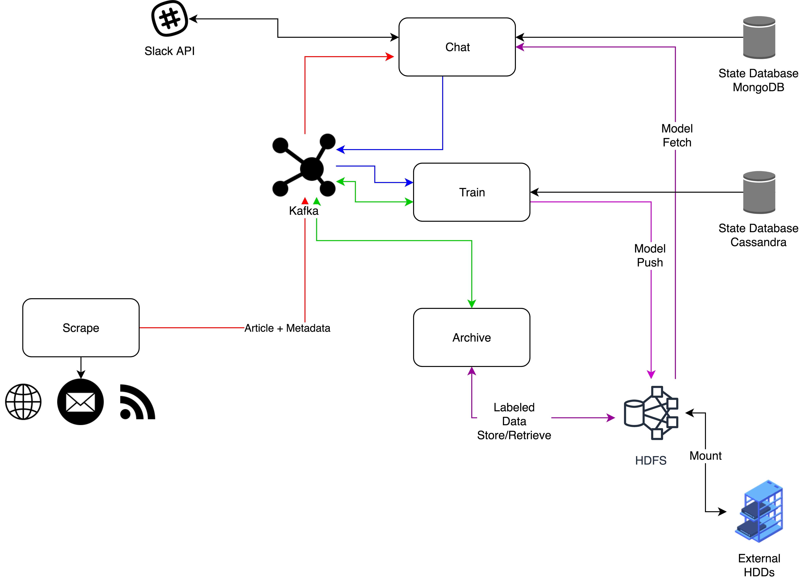

# newsSummarizer

Answers the questions you care about from your favourite newsletters through a chatbot

## Design

- Cassandra cluster is preffered for realtime big data with SQL like interface.
- Cassandra out performs other NoSQL databases
- MongoDB will be easier to keep "current state" like information
- Cassandra cluster can be used to store data plane (in-use articles, labels etc.)
- Tensorflow model needs to be saved to the file system. Maybe backed up to cloud.
- Archive service will store labelled data in HDFS cluster. Cluster mounted on large disk.
