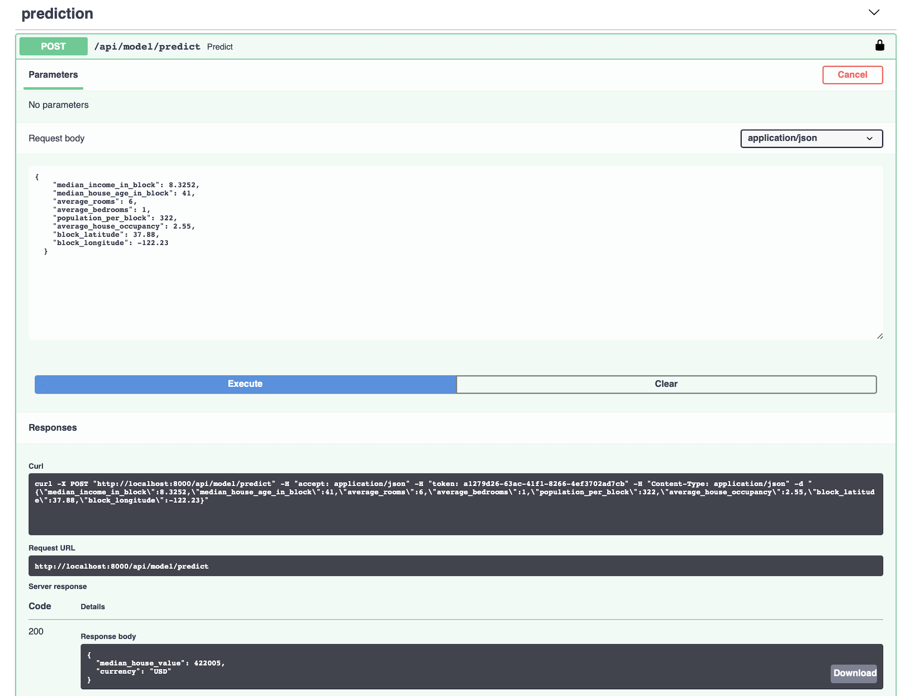

# Learn

Project N service that provides API endpoints over ML models.

## TODO

- Add POST endpoint for summary with model name and payload with text.
- Watch toutorias like:
  - Using huggingFace for sentiment analysis: <https://www.youtube.com/watch?v=Osj0Z6rwJB4>
  - Slides from HF authors from workshop: <https://docs.google.com/presentation/d/1fIhGikFPnb7G5kr58OvYC3GN4io7MznnM0aAgadvJfc/edit#slide=id.g5888218f39_177_4>
- See how (serving a model quickly with ray library <https://medium.com/distributed-computing-with-ray/the-simplest-way-to-serve-your-nlp-model-in-production-with-pure-python-d42b6a97ad55> can be applied.
- checkout <https://yale-lily.github.io/>
- See HF sample classification notebooks: <https://github.com/huggingface/notebooks/blob/master/examples/text_classification.ipynb>
- Bring over some summarisation and classification models from: <https://github.com/novetta/adaptnlp>
- See what is useful in Microsoft's library: <https://github.com/microsoft/fastformers>
- test with a unit/integration test that the endpoint works.
- Move to scrape/ before proceeding.
- See <https://opendatascience.com/state-of-the-art-text-classification-made-easy> for help with above.
- add a model under ml_models/ that uses huggingface summarization.
- Bring in code snippets from <https://github.com/shreyashankar/gpt3-sandbox>
- Bring in snippets for: <https://opendatascience.com/named-entity-recognition-with-spacy-to-identify-actors-and-actions-in-news-articles/>
- See how keys and tests are used/run in: <https://github.com/novetta/adaptnlphttps://medium.com/@8B_ECtutorial-serving-machine-learning-models-with-fastapi-in-python-c1a27319c459>
- Add <https://github.com/miso-belica/sumy> as a fixed/baseline summirization lib.

## See below for instructions

Serving machine learning models production-ready, fast, easy and secure powered by the great FastAPI by [Sebastián Ramírez]([)](https://github.com/tiangolo).

This repository contains a skeleton app which can be used to speed-up your next machine learning project. The code is fully tested and provides a preconfigured `tox` to quickly expand this sample code.

To experiment and get a feeling on how to use this skeleton, a sample regression model for house price prediction is included in this project. Follow the installation and setup instructions to run the sample model and serve it aso RESTful API.

## Requirements

Python 3.7+

## Installation

Install the required packages in your local environment (ideally virtualenv, conda, etc.).

```bash
pip install -r requirements
```

## Setup

1. Duplicate the `.env.example` file and rename it to `.env`
2. In the `.env` file configure the `API_KEY` entry. The key is used for authenticating our API. A sample API key can be generated using Python REPL:

```python
import uuid
print(str(uuid.uuid4()))
```

## Run It

1. Start your  app with:

  ```bash
  uvicorn app.main:app
  ```

2. Go to [http://localhost:8000/docs](http://localhost:8000/docs).

3. Click `Authorize` and enter the API key as created in the Setup step.


4. You can use the sample payload from the `docs/sample_payload.json` file when trying out the house price prediction model using the API.
  

## Run Tests

If you're not using `tox`, please install with:

```bash
pip install tox
```

Run your tests with:

```bash
tox
```

This runs tests and coverage for Python 3.6 and Flake8, Autopep8, Bandit.
